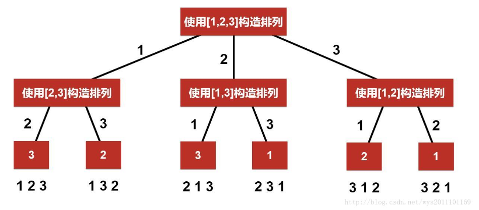

# leetcode刷题记录

## 字典树
Trie树，是一种树形结构，是一种哈希树的变种。典型应用是用于统计，排序和保存大量的字符串（但不仅限于字符串），所以经常被搜索引擎系统用于文本词频统计。它的优点是：利用字符串的公共前缀来减少查询时间，最大限度地减少无谓的字符串比较，查询效率比哈希树高。  
应用：串的快速检索，最长公共前缀（IP路由）  
常用操作：插入，查找，前缀匹配  
如下图：对于一个单词集合{'am','bad','be','so'}，可以画出字典树：  
  
代码：[字典树实现代码](字典树(Trie)/实现字典树.py)  
Python版本的代码借鉴了两个版本:  
版本一：[代码](字典树(Trie)/实现字典树.py) 版本二：[代码]()
leetcode相关题目：[实现 Trie (前缀树)](https://leetcode-cn.com/problems/implement-trie-prefix-tree/), [添加与搜索单词 - 数据结构设计](https://leetcode-cn.com/problems/add-and-search-word-data-structure-design/)  

***
## 回溯算法

解决回溯问题最好的方法就是先将树形图画出来，举个例子对于简单的全排列问题，即求集合｛1,2,3｝的全排列。画出树形图如下：

