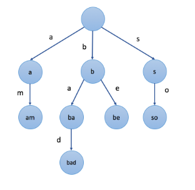

# leetcode刷题记录
***  
### Python相关  
对二维数组（或者字典）按第一个元素升序： sorted(arr, key=lambda x:x[0])  
对二维数组（或者字典）先按第一个元素升序再按第二个元素降序： sorted(arr, key=lambda x: (x[0], -x[1]))  
创建二维数组(m * n)：dp = [[[0] * n] for _ in range(m)] 而 不能用[0] * m] * n这是错误的  
创建三维数组(k * m * n)：dp = [[[0] * n for _ in range(m)] for _ in range(k)]   

***  
## 动态规划  
[刷题tag链接](https://zhuanlan.zhihu.com/p/126546914?utm_source=wechat_session&utm_medium=social&utm_oi=27134168924160%E3%80%82)  
* 线性DP: 最长上升子序列 (LIS)，最长公共子序列 (LCS)，[俄罗斯套娃信封问题](https://leetcode-cn.com/problems/russian-doll-envelopes/)
- 区间DP：[最长回文子序列](https://leetcode-cn.com/problems/longest-palindromic-subsequence/), [统计不同回文子序列](https://leetcode-cn.com/problems/count-different-palindromic-subsequences/) [解析](https://blog.csdn.net/heshiliqiu/article/details/105968340), [戳气球](https://leetcode-cn.com/problems/burst-balloons/)★, [奇怪的打印机](https://leetcode-cn.com/problems/strange-printer/) [解析](https://www.cnblogs.com/grandyang/p/8319913.html)★
  
* 背包DP: [分割等和子集](https://leetcode-cn.com/problems/partition-equal-subset-sum/)(01背包问题), [零钱兑换](https://leetcode-cn.com/problems/coin-change/)(完全背包), [零钱兑换 II
](https://leetcode-cn.com/problems/coin-change-2/)(完全背包), [一和零](https://leetcode-cn.com/problems/ones-and-zeroes/)(二维费用背包)  
* 树形DP: [二叉树中的最大路径和](https://leetcode-cn.com/problems/binary-tree-maximum-path-sum/), [打家劫舍 III](https://leetcode-cn.com/problems/house-robber-iii/)★  
* 状压DP: [我能赢吗](https://leetcode-cn.com/problems/can-i-win/), [优美的排列](https://leetcode-cn.com/problems/beautiful-arrangement/)  
***  
## 字典树
Trie树，是一种树形结构，是一种哈希树的变种。典型应用是用于统计，排序和保存大量的字符串（但不仅限于字符串），所以经常被搜索引擎系统用于文本词频统计。它的优点是：利用字符串的公共前缀来减少查询时间，最大限度地减少无谓的字符串比较，查询效率比哈希树高。    
应用：串的快速检索，最长公共前缀（IP路由）    
常用操作：插入，查找，前缀匹配  
如下图：对于一个单词集合{'am','bad','be','so'}，可以画出字典树：  
  
代码：[字典树实现代码](字典树(Trie)/实现字典树.py)  
Python版本的代码借鉴了两个版本:  
版本一：[代码](https://github.com/BlossomingL/leetcode/blob/master/%E5%AD%97%E5%85%B8%E6%A0%91(Trie)/%E5%AE%9E%E7%8E%B0%20Trie%20(%E5%89%8D%E7%BC%80%E6%A0%91)%E7%89%88%E6%9C%AC1.py)  
版本二：[代码](https://github.com/BlossomingL/leetcode/blob/master/%E5%AD%97%E5%85%B8%E6%A0%91(Trie)/%E5%AE%9E%E7%8E%B0%20Trie%20(%E5%89%8D%E7%BC%80%E6%A0%91)%E7%89%88%E6%9C%AC2.py)  
这两个版本的唯一不同的就是定义存储字典树的数据结构稍微有点差别，前者仅仅使用一个字典以及是否为最后一个单词的标记，后者为每个单词设置一个对象，对象中包含下一个单词和是否为最后一个单词。有时候后面一个版本可能会方便一点。  
leetcode相关题目：[实现 Trie (前缀树)](https://leetcode-cn.com/problems/implement-trie-prefix-tree/), [添加与搜索单词 - 数据结构设计](https://leetcode-cn.com/problems/add-and-search-word-data-structure-design/), [单词替换](https://leetcode-cn.com/problems/replace-words/)

***
## 回溯算法

解决回溯问题最好的方法就是先将树形图画出来，举个例子对于简单的全排列问题，即求集合｛1,2,3｝的全排列。画出树形图如下：
  

## 牛客  
[整数分块](https://blog.csdn.net/duanghaha/article/details/82863766)  
[快速幂](https://github.com/BlossomingL/leetcode/blob/master/%E7%89%9B%E5%AE%A2/%E5%BF%AB%E9%80%9F%E5%B9%82.py)
